# Offenes, KI-gestuetztes Forschungsnotizbuch zu einem Gittermodell

Raum als gefuelltes Tetraedernetz: Modellrechnungen, Hypothesen und Negativbefunde. Stand 08.10.2026.

**In short (English).** This is an open lab notebook, written largely by AI agents (Claude, Codex and others) under the
direction of Finn Hinrichsen, about a lattice model in which space is a filled tetrahedral network ("V"). On small
lattices it computes linearised and second-order gravity, compact U(1) and SU(2) gauge fields, a quantised Q-ball scalar
and a classical Higgs-portal model. The architecture (Regge gravity + discrete Maxwell + scalar on one simplicial
complex) is known from the literature; only the computations on this particular network are our own. It does not derive
particle masses, SU(3), the weak force, the Higgs mechanism, spin 1/2 or three generations, and nothing has been tested
against measured data or peer-reviewed. The robust findings, with numbers and limits, are in [RESULTS.md](RESULTS.md).

## Kurz gesagt

1. **Was das ist:** ein offenes Laborbuch zu einem Gittermodell, in dem der Raum ein gefuelltes Tetraedernetz V ist;
   Texte und Code sind ueberwiegend von KI-Systemen erstellt ([BETEILIGTE.md](BETEILIGTE.md)), Ideen und Richtung von
   Finn Hinrichsen.
2. **Was gerechnet ist:** auf kleinen Netzen Schwerkraft im Fernfeld (Lichtablenkung, Shapiro, PPN beta), kompakte
   U(1)- und SU(2)-Eichfelder per Monte Carlo, ein quantisiertes Q-Ball-Skalarfeld und ein klassisches Higgsportal-Modell.
3. **Was nicht neu ist:** Die Architektur Regge-Gravitation + diskretes Maxwell (DEC) + Skalarfeld ist Literatur (unter
   anderem McDonald/Miller 2010), und mehrere Befunde bestaetigen bekanntes Verhalten auf einem neuen Netz. Eigen sind
   nur die Rechnungen auf diesem Netz.
4. **Was nicht gezeigt ist:** keine Herleitung von Teilchenmassen, SU(3), schwacher Kraft, Higgsmechanismus oder drei
   Generationen, kein Mechanismus fuer Spin 1/2, keine Vorhersage, die an Messdaten geprueft waere.
5. **Wie belastbar:** alles synthetisch, kleine Gitter, nicht begutachtet; mehrere Laeufe explorativ ohne Vorab-Plan.
   Belastbare Befunde und Negativbefunde mit Zahlen und Grenzen stehen in [RESULTS.md](RESULTS.md).

## Wo anfangen

| Wenn Sie ... | dann lesen Sie |
|---|---|
| die belastbaren Befunde suchen | [RESULTS.md](RESULTS.md) (englisch) |
| den aktuellen Stand und die naechsten Schritte suchen | [STAND-UND-NAECHSTE-SCHRITTE.md](STAND-UND-NAECHSTE-SCHRITTE.md) |
| die Modellgleichung sehen wollen | [GRUNDGLEICHUNG-v3](coordination/runden-v3/RUNDE-50/GRUNDGLEICHUNG-v3.md) |
| wissen wollen, wer was geschrieben hat | [BETEILIGTE.md](BETEILIGTE.md) |
| wissen wollen, was bewusst fehlt | [AUSSCHLUESSE.md](AUSSCHLUESSE.md) |

### Verzeichnisfuehrer

`coordination/` ist das **Laborbuch**: Rohprotokolle in der Reihenfolge der Arbeit, mit Zeitstempeln, Irrwegen und
Berichtigungen. Es ist nicht nachtraeglich geglaettet; Ordnernamen bleiben stabil, damit Verweise gueltig bleiben.

- `coordination/runden-v3/`: Arbeitsrunden. `RUNDE-NN.md` ist das Protokoll einer Runde; `RUNDE-NN/<name>/` enthaelt
  je Untersuchung die Karte (Erwartungen vor der Rechnung), `ERGEBNIS.md`, Code und Pruefsummen. Die meisten Ergebnisse
  liegen in `RUNDE-37/`. `netz-gpu/` ist die GPU-Engine.
- `coordination/higgs-*-2026100x/`: Higgsportal-Linie (Bestandsaufnahme, Verbindungsideen, fuenf Rechentests mit Plan,
  Code, Ergebnisdateien und Provenienz).
- `coordination/research-journal/`: Forschungsjournal als JSON; Eintraege werden nicht geaendert, Berichtigungen sind
  neue Eintraege.
- `coordination/einfach-gesagt/`: Kurzfassungen in einfacher Sprache.
- `model-lab/papers/`: eigene Papierentwuerfe (nicht eingereicht, nicht begutachtet).
- `model-lab/netz-viewer/`: Quelltext der Netz-Ansicht, die unter https://physics.fmhc.io/netz/ laeuft.
- `assets/research/`: schematische Bereichsgrafiken und ihr Erzeugungsskript.

### Kennzeichen im Material

[E] gerechnet, [M] Mathematik am Schreibtisch, [L] Literatur aus dem Gedaechtnis, [S] an der Quelle gelesen,
[H] Hypothese. Rechnungen laufen auf kleinen, periodischen Netzen; "synthetisch" heisst: keine Messdaten.

## Stand je Bereich (07./08.10.2026)

Je Bereich steht, was gerechnet ist, was Hypothese ist und welcher Mechanismus fehlt. Alle Rechnungen sind synthetisch,
auf kleinen Netzen und nicht begutachtet.

**Zur Spalte "Subjektive Reife":** grobe, subjektive Einschaetzung der Leitung, wie weit der Bereich von einem
vollstaendigen physikalischen Mechanismus entfernt ist. Sie ist keine Wahrscheinlichkeit, kein Messwert und kein
bestaetigter Anteil, und sie wird nicht zu einem Gesamtwert gemittelt. Die verlinkten Ergebnisdateien haben Vorrang.

| Bereich | Subjektive Reife | Gerechnet [E] | Hypothese [H] | Fehlt |
|---|---|---|---|---|
| Netz und Raum | 65 % | Netz V mit Gewichten; Umklappen mit Traegheit am Netz ([UMKLAPP-FOLGE-1](coordination/runden-v3/RUNDE-37/umklapp-folge-1/ERGEBNIS.md), [NETZ-NICHTLINEAR-1](coordination/runden-v3/RUNDE-37/netz-nichtlinear-1/ERGEBNIS.md)); mit fester 4-Volumen-Bedingung laufen 3 von 4 Testnetzen stabil, ohne sie keins ([VOLUMEN-G2-1](coordination/runden-v3/RUNDE-37/volumen-g2-1/ERGEBNIS.md)) | Volumenerhalt (unimodular) als Grundregel | voll nichtlineare Rechnung mit allen Ableitungen; Herleitung des Netzes |
| Schwerkraft | 55 % | Fernfeld wie ART, linear (Lichtablenkung, Shapiro: [LICHT-ABLENKUNG-V](coordination/runden-v3/RUNDE-37/licht-ablenkung-v/ERGEBNIS.md)) und in zweiter Ordnung (PPN beta ~ 1: [BETA-NETZ-V](coordination/runden-v3/RUNDE-37/beta-netz-v/ERGEBNIS.md)); Wirkung: [GRUNDGLEICHUNG-v3](coordination/runden-v3/RUNDE-50/GRUNDGLEICHUNG-v3.md); Perihel-Faktor aus diesen Netzwerten 0,993 bis 1,000 (PPN-Arithmetik, [ANTIGRAVITY-NACHBAU-1](coordination/runden-v3/RUNDE-37/antigravity-nachbau-1/ERGEBNIS.md)) | - | Nahfeld, Kollaps, nichtlineare Dynamik |
| Licht | 55 % | DEC-Maxwell auf V; quantisiert ein masseloses, richtungsgleiches Photon ([QUANT-2](coordination/runden-v3/RUNDE-37/quant-2/ERGEBNIS.md)) | - | Kopplungskonstante nicht hergeleitet |
| Materiefeld (Q-Baelle) | 30 % | Q-Ball-Feld quantisiert (HMC): kein belastbarer Bindungsnachweis fuer 2 bis 5 Quanten, klassische Q-Baelle erst ab etwa 112/lam Quanten ([QUANT-1](coordination/runden-v3/RUNDE-37/quant-1/ERGEBNIS.md)) | Q-Baelle als schwere Vielteilchen-Objekte | Massen kleiner Teilchen |
| Starke Kraft | 40 % | SU(2) auf dem Netz: Einschluss, Deconfinement ohne Volumenuebergang; Flow-Skalen bei zwei Gitterabstaenden auf etwa 1 bis 3 % wie der Hyperkubus, begrenzt durch die Unsicherheit von beta_c ([QUANT-3](coordination/runden-v3/RUNDE-37/quant-3/), S5, S6) | - | SU(3); Fadenspannung (unentschieden); groessere Volumina |
| Mesonen, Baryonen | 10 % | Unveraenderte Q-Baelle sind keine Hadronen: bosonisch, Drehimpulssprung um die ganze Ladung, keine Regge-Gerade ([QBALL-HADRON-1](coordination/runden-v3/RUNDE-37/qball-hadron-1/ERGEBNIS.md)). Q-Ball-Dreierbuendel binden ([QBALL-DREIPOL-1](coordination/runden-v3/RUNDE-37/qball-dreipol-1/ERGEBNIS.md)). Positive Strukturbefunde mit Grenzen: Das 2D-Dreieck ist in allen geprueften Stoerrichtungen ein lokales Minimum ([-2](coordination/runden-v3/RUNDE-37/qball-dreipol-2/ERGEBNIS.md)); 3D-Dreieck und endliche Stabilitaet sind gerechnet ([-3](coordination/runden-v3/RUNDE-37/qball-dreipol-3/ERGEBNIS.md)). Die Symmetrie bleibt aber U(1)^3, kein SU(3), kein Einschluss, kein Baryonennachweis. Negative Wirbelmodelltests: Wirbel-Dreier und -Paare werden abgeschirmt bzw. als Beutel gebunden statt durch einen belastbaren Y-Faden ([Y-1](coordination/runden-v3/RUNDE-10/y1/ERGEBNIS.md), [Y-2](coordination/runden-v3/RUNDE-11/y2/ERGEBNIS.md)) | Faeden mit zwei bzw. drei Enden als Meson bzw. Baryon | jeder Mechanismus mit Einschluss und Quantenzahlen |
| Spin 1/2 | 20 % | Fadenenden mit Fermion-Statistik (Twist); 2-pi-Vorzeichen nur per Buchhaltung, aus einer getrennten Regel ([GERAHMTER-FADEN-1](coordination/runden-v3/RUNDE-37/gerahmter-faden-1/ERGEBNIS.md)) | doppelte Wertung (SU(2)-Rahmen) als Dynamik | eine Dynamik, die Spin und Statistik koppelt |
| Schwache Kraft | 2 % | Kein eigener Mechanismus; Vorarbeit ist eine Literaturauswertung mit Hypothesen zu Abstrahlkanaelen ([RUNDE-20/ew-baelle](coordination/runden-v3/RUNDE-20/ew-baelle/ERGEBNIS.md)) | - | eigener Mechanismus (SU(2)xU(1)) |
| Higgs | 2 % (Herleitung) | [Higgsportal B13–B23](coordination/higgs-bestandsaufnahme-20261007/BESTAND.md): stationäre Profile und zeitabhängige 3D-Felder mit dynamischer Higgsamplitude; vorhandene Ergebnisdateien gesichtet. Neu (08.10.): reduzierte Higgsenergie gegen die volle Portaltheorie geprueft (Profile, Kraefte, Minima, Energiekruemmungen; siehe unten). Kein eigener Higgsmechanismus aus dem Netz | Portalmodelle als zusätzliche Modellklasse | Herleitung von Higgsmasse/Vakuumwert; chirale Materie und elektroschwache Eichdynamik; Übertragung auf V |
| Generationen | 2 % | Negativbefund: Ohne Spin-Bahn-Term geben 64 Flussmuster des Diamanten keine isolierten Knoten; die Massenfolge waere frei einstellbar ([ANTIGRAVITY-NACHBAU-1](coordination/runden-v3/RUNDE-37/antigravity-nachbau-1/ERGEBNIS.md)) | - | Mechanismus fuer drei Generationen |
| Vergleich mit Messdaten | 5 % | nur Schranken (GW170817, Doppelbrechung) | - | Vorhersagen |
| Quantengravitation | 7 % | CDT-artiges dynamisches Netz mit Feldern ([NETZ-DYN-1](coordination/runden-v3/RUNDE-37/netz-dyn-1/ERGEBNIS.md)); Messwerkzeug geeicht, konvergiert langsam ([DS-EICHUNG-2D-1](coordination/runden-v3/RUNDE-37/ds-eichung-2d-1/ERGEBNIS.md)) | 4D aus Zeitschichten | grosse Volumina |

Neues und naechste Schritte: [STAND-UND-NAECHSTE-SCHRITTE.md](STAND-UND-NAECHSTE-SCHRITTE.md).

<!-- BEGIN RESEARCH GRAPHICS -->
## Forschungsbereiche in Bildern

Die Grafiken sind schematische Erklärbilder, keine Simulationsergebnisse oder Messdaten. Prozentwerte sind subjektive Entwicklungsschätzungen zum Stand 07.10.2026. Durch Anklicken lassen sich die Grafiken vergrößern; die Berichte darunter liefern Befunde und Grenzen.

| | |
|---|---|
| [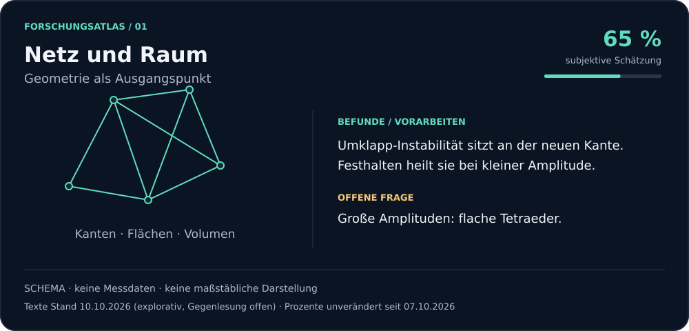](assets/research/netz.svg) **Netz und Raum** · [Befunde](coordination/runden-v3/RUNDE-37/volumen-g2-1/ERGEBNIS.md) | [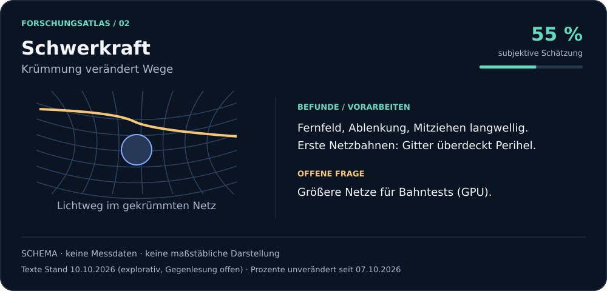](assets/research/gravitation.svg) **Schwerkraft** · [Befunde](coordination/runden-v3/RUNDE-50/GRUNDGLEICHUNG-v3.md) |
| [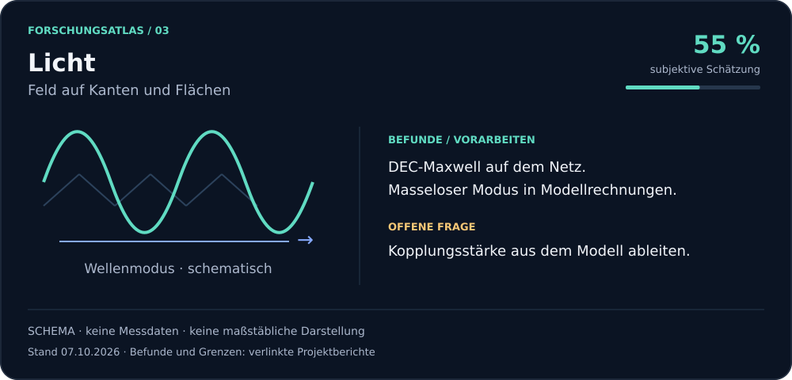](assets/research/licht.svg) **Licht** · [Befunde](coordination/runden-v3/RUNDE-37/quant-2/ERGEBNIS.md) | [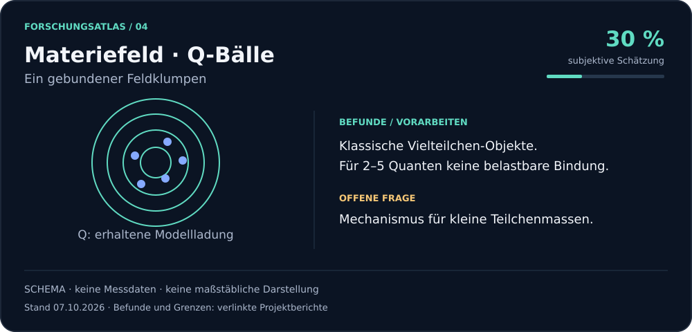](assets/research/materie.svg) **Materiefeld · Q-Bälle** · [Befunde](coordination/runden-v3/RUNDE-37/quant-1/ERGEBNIS.md) |
| [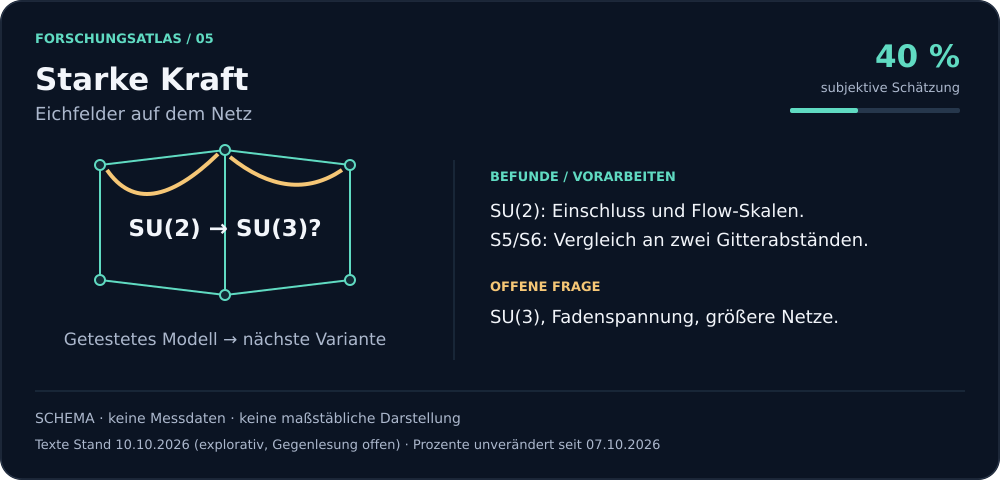](assets/research/stark.svg) **Starke Kraft** · [Befunde](coordination/runden-v3/RUNDE-37/quant-3/ERGEBNIS-S6.md) | [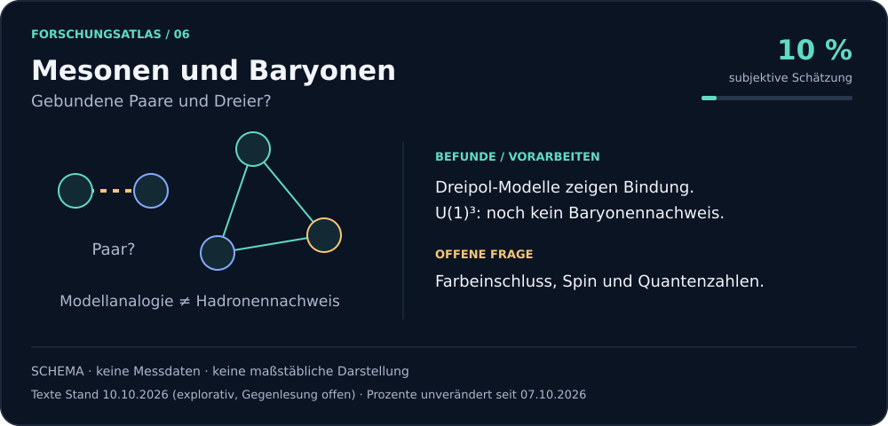](assets/research/hadronen.svg) **Mesonen und Baryonen** · [Befunde](coordination/runden-v3/RUNDE-37/qball-dreipol-3/ERGEBNIS.md) |
| [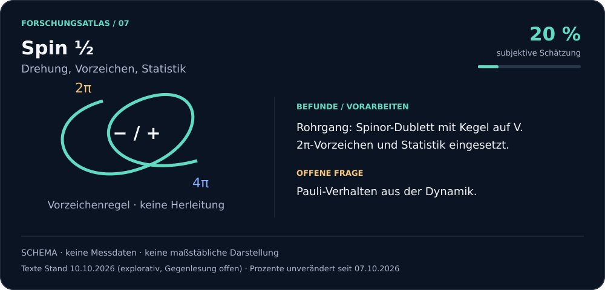](assets/research/spin.svg) **Spin ½** · [Befunde](coordination/runden-v3/RUNDE-37/gerahmter-faden-1/ERGEBNIS.md) | [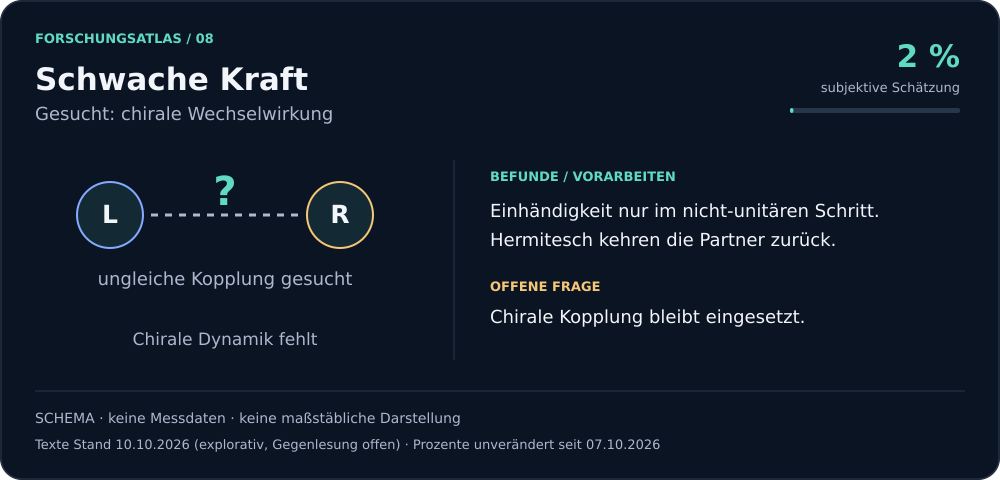](assets/research/schwach.svg) **Schwache Kraft** · [Befunde](coordination/runden-v3/RUNDE-20/ew-baelle/ERGEBNIS.md) |
| [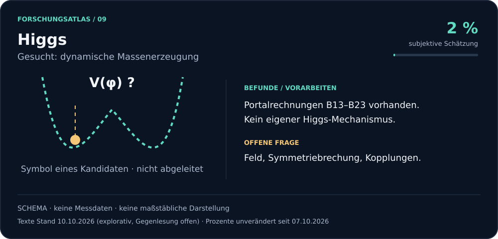](assets/research/higgs.svg) **Higgs** · [Befunde](coordination/runden-v3/../higgs-bestandsaufnahme-20261007/BESTAND.md) | [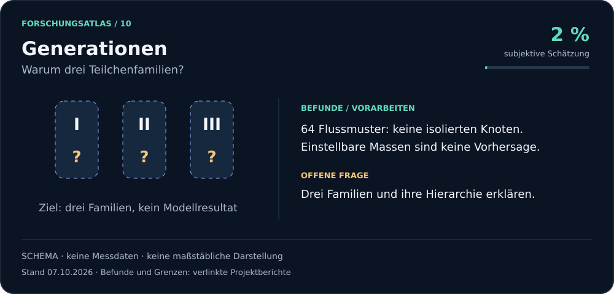](assets/research/generationen.svg) **Generationen** · [Befunde](coordination/runden-v3/RUNDE-37/antigravity-nachbau-1/ERGEBNIS.md) |
| [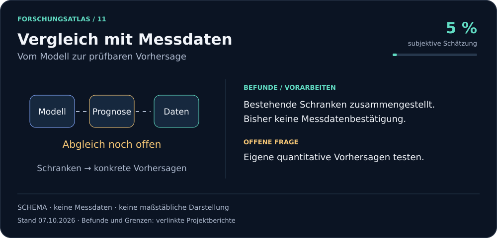](assets/research/messdaten.svg) **Vergleich mit Messdaten** · [Befunde](coordination/runden-v3/RUNDE-50/GRUNDGLEICHUNG-v3.md) | [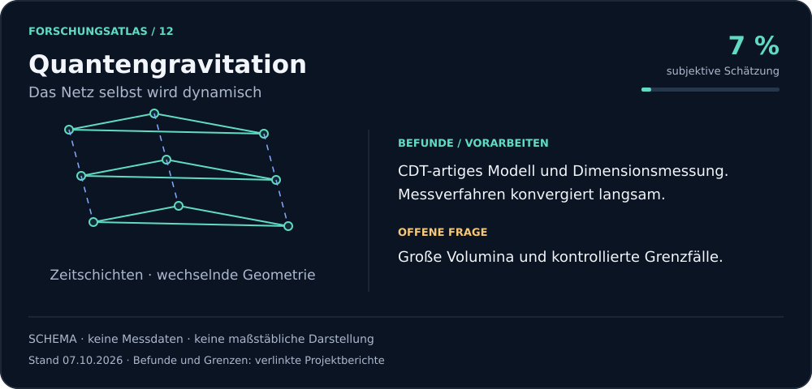](assets/research/quantengravitation.svg) **Quantengravitation** · [Befunde](coordination/runden-v3/RUNDE-37/ds-eichung-2d-1/ERGEBNIS.md) |

Modellideen werden auf Passung zum Netz, bekannte Befunde und prüfbare Vorhersagen untersucht. Die Bilder behaupten insbesondere keine Herleitung von Hadronen, Higgs oder Teilchenfamilien.

<!-- END RESEARCH GRAPHICS -->

## Higgsportal-Linie (07./08.10.2026)

Ein klassisches Modell mit zwei komplexen Singulettfeldern und einer realen Higgsamplitude, radial in drei
Raumdimensionen. Higgsmasse und Vakuumwert sind Eingaben; das Modell leitet den Higgsmechanismus nicht her und ist nicht
auf V gerechnet. Die Prozentwerte oben bleiben deshalb unveraendert.

- **Bestand:** Fruehere Portalrechnungen B13 bis B23 (stationaere Profile, zeitabhaengige 3D-Felder) wurden wiedergefunden;
  die Bildungsversuche B22/B23 verfehlten ihre Kriterien. [Bestandsaufnahme](coordination/higgs-bestandsaufnahme-20261007/BESTAND.md)
- **Zehn Verbindungsideen** in drei analytischen Runden, ohne neue Rechnung, mit einer Pruefnotiz zu einer Mathematik-
  Veroeffentlichung von OpenAI. [Uebersicht](coordination/higgs-verbindungen-20261007/README.md)
- **Fuenf Rechentests** mit vorab gesetzten Kriterien (CUDA, float64). Fehler sind Abweichungen von der vollen Theorie,
  keine statistischen Unsicherheiten:
  1. [Higgsantwort](coordination/higgs-response-20261008/ERGEBNIS.md) an 24 archivierten Profilen: Die Antwort zweiter
     Ordnung erreicht 0,026 bis 0,028 % Profilfehler bei schwacher und 0,64 bis 0,71 % bei staerkerer Kopplung; sie
     wurde geplant, nachdem die erste Ordnung bei staerkerer Kopplung scheiterte. Lokale Naeherungen scheitern.
  2. [Kraefte](coordination/higgs-force-20261008/ERGEBNIS.md): Die vollstaendige Ableitung der reduzierten Energie Ecomp
     hat 0,0097 bis 0,0116 % Kraftfehler; einfaches Einsetzen laesst einen Kettenregelbeitrag von etwa 0,6 % weg.
  3. [Selbstkonsistente Profile](coordination/higgs-minima-20261008/ERGEBNIS.md), 18 Relaxationen an einem Parameterpunkt:
     Materieprofil mit Ecomp hoechstens 0,000066 % daneben, die rekonstruierte Higgsamplitude etwa 0,65 %.
  4. [Energiekruemmungen der vollen Theorie](coordination/higgs-modes-20261008/ERGEBNIS.md): keine negative Richtung in
     acht Sektoren (l = 0 bis 3) nach Abzug der Symmetrierichtungen; statisch, keine Schwingungsfrequenzen.
  5. [Radiale Kruemmungen der reduzierten Modelle](coordination/higgs-reduced-modes-20261008/ERGEBNIS.md): hoechstens
     0,0099 % (E3) und 0,00025 % (Ecomp) Eigenwertfehler; Winkelantwort offen.

| | |
|---|---|
| [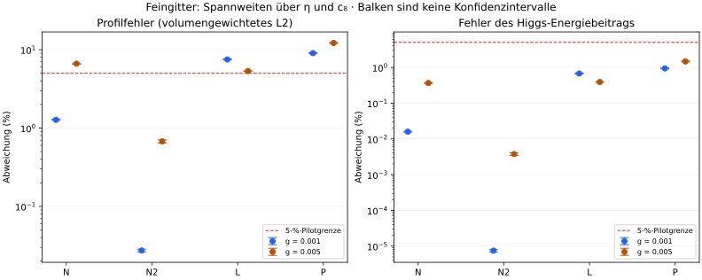](coordination/higgs-response-20261008/ERGEBNIS.md) | [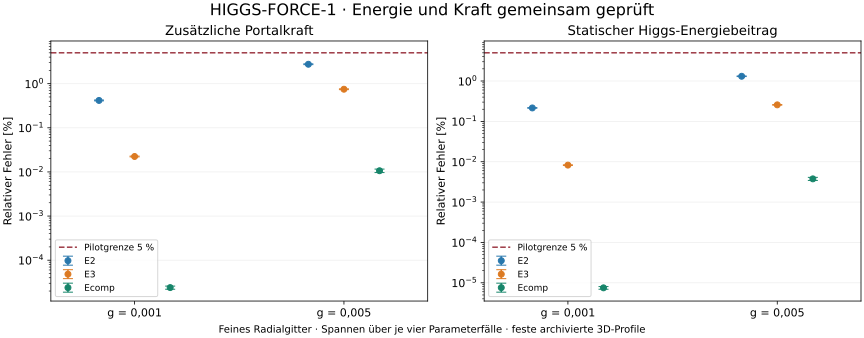](coordination/higgs-force-20261008/ERGEBNIS.md) |
| [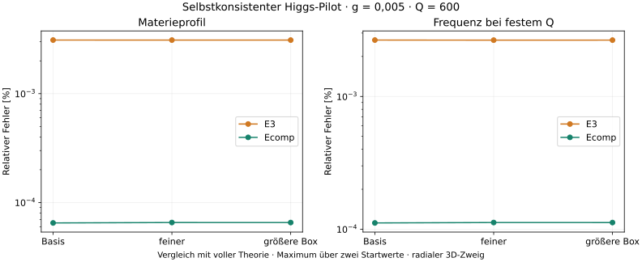](coordination/higgs-minima-20261008/ERGEBNIS.md) | [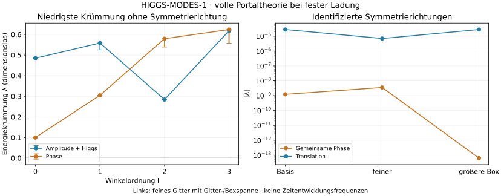](coordination/higgs-modes-20261008/ERGEBNIS.md) |
| [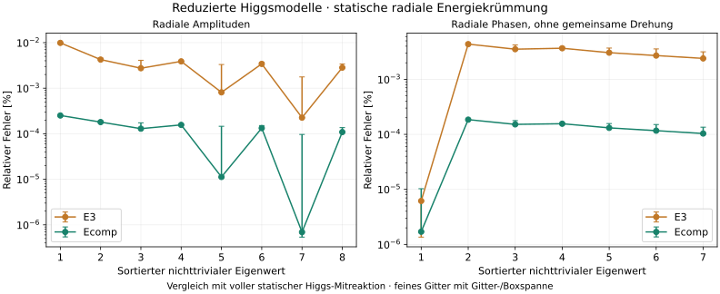](coordination/higgs-reduced-modes-20261008/ERGEBNIS.md) | |

## Literaturvergleich und naechste Pruefungen (07.10.2026)

Sechs neue arXiv-Arbeiten und zwei aeltere Kontrollen wurden in den relevanten Volltextabschnitten gelesen und mit den
eigenen Ansaetzen verglichen (Hadronen, chirale Materie, Higgs, Schranken). Das ist Quellenlektuere und Modellplanung,
keine neue Simulation. [Vergleich und Primaerquellen](coordination/runden-v3/RUNDE-51/modell-screening-1/VOLLTEXT-VERGLEICH-20261007.md) ·
[Kandidatenmatrix](coordination/runden-v3/RUNDE-51/modell-screening-1/KANDIDATENMATRIX.md) ·
[Modellfahrplan](coordination/runden-v3/RUNDE-51/modell-screening-1/MODELLFAHRPLAN.md). Eine der Pruefkarten ist
inzwischen beantwortet: Zopf-Preonmodelle passen nicht als Teilgraph in V
([ZOPF-SIMPLIZIAL-L](coordination/runden-v3/RUNDE-51/zopf-simplizial-l/ERGEBNIS.md)).

## Bewusst nicht enthalten

- Versiegelte Vorhersagen und Vertraege laufender Blindtests
- Kopien fremder Literatur
- Personendaten, Betriebs- und Steuerdateien, Rohdatenreihen
- Nicht gepruefte KI-Entwuerfe vom 06./07.10.2026, die Durchbrueche behaupten, ohne dass sie gerechnet oder gegengelesen
  sind

Details in [AUSSCHLUESSE.md](AUSSCHLUESSE.md).

## Lizenz und Zitieren

- Texte, Abbildungen und eigene Daten: [CC BY 4.0](LICENSE), Urheber Finn Hinrichsen.
- Code: [Apache-2.0](LICENSE-CODE).
- Namensnennung siehe [NOTICE](NOTICE).
