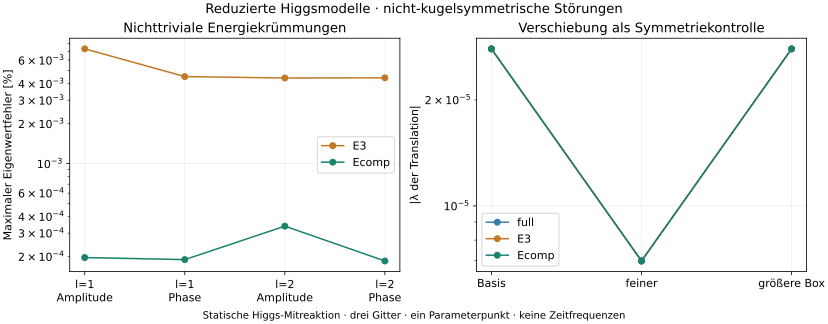

# HIGGS-ANGULAR-MODES-1: reduzierte Modelle bestehen die Winkelprüfung

08.10.2026 · [E] neue CUDA-Rechnung, Anschluss an [HIGGS-REDUCED-MODES-1](../higgs-reduced-modes-20261008/ERGEBNIS.md).

**E3 und Ecomp bestehen den vorab festgelegten Vergleich für nicht-kugelsymmetrische Störungen in l=1 und l=2.** Der größte relative Fehler der geprüften nichttrivialen Energiekrümmungen beträgt **0,007295 % für E3** und **0,0003385 % für Ecomp**. Die Translationsrichtung wird in beiden reduzierten Modellen wie in der vollen statischen Referenz erkannt.



Zusammen mit dem vorherigen Bericht sind damit für diesen Parameterpunkt die radialen Störungen und zwei nicht-radiale Winkelordnungen geprüft. Es handelt sich weiterhin um **statische Energievariationen**, keine dynamischen Frequenzen oder Langzeitsimulationen.

## Umfang und Ergebnis

Volle statische Referenz, E3 und Ecomp auf jeweils ihren eigenen stationären seed=0-Profilen aus HIGGS-MINIMA-1. Ein Parameterpunkt: eta=0,05, g=0,005, c8=0, Q=600. Drei Radialgitter (Basis R=20,h=0,05; fein R=20,h=0,025; größere Box R=30,h=0,05). Zwei Winkelordnungen, jeweils reelle Materieamplituden und imaginäre Phasen: **36 Eigenwertmatrizen**. Keine erneute Relaxation, kein Parameterfit.

Die Winkelordnung l=1 umfasst insbesondere eine Verschiebung des ganzen Objekts; l=2 beschreibt quadrupolare Verformungen. Die Hintergrundprofile sind radial, die geprüften Störungen sind es nicht. Bei kugelsymmetrischem Hintergrund sind die 2l+1 Winkelrichtungen innerhalb derselben Ordnung entartet. Die direkte Winkelkontrolle verwendet den achsensymmetrischen Vertreter; die linearen Operatoren hängen nicht von dessen Orientierung ab.

| Diagnose | E3 | Ecomp |
|---|---:|---:|
| Maximaler relativer Eigenwertfehler | 0,007295 % | 0,0003385 % |
| Größter Fehlerdrift zwischen Gitter/Box | 0,003270 Prozentpunkte | 0,00007264 Prozentpunkte |
| Kleinster quadrierter Eigenvektorüberlapp mit der Referenz | 0,99999998784 | 0,999999999978 |
| Translation nach Vorabkriterien identifiziert | ja | ja |
| Übrige geprüfte Eigenwerte positiv | ja | ja |
| Gesamtes Vorabkriterium | bestanden | bestanden |

Die Entscheidung verwendet den maximalen Fehler **plus** beobachteten Drift, mit vorab festgelegter Grenze 5 % und Driftgrenze 0,5 Prozentpunkte. Alle verbleibenden Eigenwerte müssen positiv über 1e-6 liegen. Verglichen wurden jeweils die acht niedrigsten Eigenpaare; im reellen l=1-Sektor wird die diagnostisch bestätigte Translation separat ausgewiesen, sodass dort sieben nichttriviale Werte verglichen werden. Kein nachträgliches Entfernen störender Werte und keine Lockerung der Kriterien.

Die Fehler vergleichen Modelle auf derselben Diskretisierungsstufe. Sie belegen keine absolute Kontinuumsgenauigkeit der einzelnen Eigenwerte. Boxabhängige höhere Eigenwerte sind keine bereits identifizierten Teilchenanregungen. Die Kurven der Translationskontrolle liegen in der Grafik wegen ihrer guten Übereinstimmung nahezu übereinander.

## Die Winkelantwort wird mitvariiert

[M] Die reduzierte Higgsenergie ist ein räumlich nichtlokales Funktional der Dichte. Ihr radialer Hessian darf deshalb nicht einfach um eine Zentrifugalbarriere ergänzt werden. Auch der inverse Higgsoperator ändert sich mit der Winkelordnung:

```
K_l = -d²/dr² + l(l+1)/r² + 6,25
```

Die Rechnung verwendet normierte Winkelharmonische mit `<Y_l>=0` und `<Y_l²>=1`. Für eine reelle Materiestörung `du_i(r) Y_l` gilt

```
S = S0 + eps*s1*Y_l + eps²*s2*Y_l²
s1 = 2 sum(u_i*du_i)/r²
s2 = sum(du_i²)/r².
```

Bei rein imaginären Störungen ist s1=0. Es genügt für die zweite Energievariation, neben dem radialen Hintergrund die erste Winkelantwort und den Winkelmittelwert der zweiten Antwort zu verfolgen. Das verwirft keine Beiträge zur gemittelten Energie in dieser Ordnung.

Schreibe z1 für die lineare räumliche Higgsantwort, z2 für ihre zweite Ordnung in der Portalkopplung, und `[0]`, `[1]`, `[2]` für Hintergrund, Koeffizient von eps und gemittelten Koeffizienten von eps². Diese Störungsordnung ist von der Portalordnung zu unterscheiden. Dann:

```
z1[0] = -K_0^-1(b*y0*r*S0)
z1[1] = -K_l^-1(b*y0*r*s1)
z1[2] = -K_0^-1(b*y0*r*s2)

z2[0] = -K_0^-1(b*S0*z1[0] + 3*a*y0*z1[0]²/r)
z2[1] = -K_l^-1(b*(S0*z1[1]+s1*z1[0])
                    + 6*a*y0*z1[0]*z1[1]/r)
z2[2] = -K_0^-1(b*(S0*z1[2]+s1*z1[1]+s2*z1[0])
                    + 3*a*y0*(2*z1[0]*z1[2]+z1[1]²)/r).
```

Normierung: b=0,5, y0=0,492, a=125²/(2*246²*0,01). Der Rechencode setzt diese Größen einschließlich sämtlicher Kreuzterme in E3 beziehungsweise in die vollständige zusammengesetzte Energie Ecomp ein. Auch der winkelabhängige Gradiententerm der Higgsenergie ist enthalten. Die reduzierte Matrix folgt anschließend durch Differentiation dieser quadratischen Energie, nicht aus einer eingesetzten Näherungskraft.

Die volle Referenz ist wie im radialen Test ein **Schur-Komplement**, diesmal mit winkelabhängigem Higgsblock. Dieser Block wurde mittels Cholesky-Zerlegung positiv faktorisiert. Da l>0 ein verschwindendes Winkelmittel hat, gibt es hier keinen radialen positiven Fix-Q-Rang-eins-Term. Die Ladungsenergie trägt weiterhin den lokalen Term mit -omega² bei.

## Unabhängige Kontrolle mit endlichen Winkelstörungen

[E] Auf dem Basisgitter wurde die Energie zusätzlich direkt bei kleinen, aber endlichen Winkelstörungen ausgewertet. Dafür wurden Dichte und Antwort in normierte Legendre-Polynome bis L=8 zerlegt und mit 24 Gauß-Legendre-Knoten integriert. Für l<=2 enthält die Dichte höchstens Ordnung 4, die definierte Antwort z1+z2 höchstens Ordnung 8 und ihre quartische Energie höchstens Grad 32. Die gewählte Winkelquadratur deckt diese Polynome ab; die radiale Diskretisierung bleibt dieselbe.

Zentrale zweite Energiedifferenzen bei eps=0,003; 0,0015; 0,00075 kontrollieren die analytisch aufgebaute quadratische Energie. Alle Kombinationen aus E3/Ecomp, l=1/l=2 und reell/imaginär bestehen die vorab gesetzte Grenze: maximaler relativer Fehler beim kleinsten Schritt **2,11e-6**, Grenze 1e-4. Vollständige Schrittfolgen stehen in QA.json. Das prüft eine festgelegte glatte Richtung pro Kombination, nicht jede Matrixkomponente einzeln.

Weitere Kontrollen:

- Radialer Grenzfall der neuen quadratischen Expansion gegen direkte Autograd-Hessian-Vektorprodukte der bisherigen Energie, auf allen Gittern: maximal **3,09e-16** relativ. Dafür wurden keine alten Radialspektren erneut gerechnet.
- Orthogonalitätsfehler der Winkelquadratur: **2,67e-15**.
- Größtes normiertes Residuum der inversen Winkeloperatoren: **5,89e-15**.
- Rohhessians vor numerischer Symmetrisierung: größte absolute Asymmetrie **6,67e-16**.
- Acht niedrigste Eigenpaare: absolutes Residuum maximal **3,13e-11**, Orthogonalitätsfehler **4,87e-14**.

Alle Kriterien bestanden im ersten ausgeführten Rechenlauf. Die vorangegangene verzögerte Rechnerabfrage erzeugte keine Rechenergebnisse.

## Translation als Symmetriekontrolle

| Modell | Basis | Feines Gitter | Größere Box |
|---|---:|---:|---:|
| Volle statische Referenz | 2,791346e-5 | 6,977907e-6 | 2,791171e-5 |
| E3 | 2,791088e-5 | 6,979410e-6 | 2,790887e-5 |
| Ecomp | 2,792282e-5 | 6,982108e-6 | 2,791470e-5 |

Die Werte schrumpfen beim Halbieren von h ungefähr um Faktor vier. Der quadrierte Überlapp mit dem aus dem Materieprofil abgeleiteten Verschiebungsvektor liegt in allen Fällen über 0,99999989. Die Boxänderung erfüllt ebenfalls das vorab festgelegte Kriterium. Deshalb wird diese Richtung als diskrete Darstellung der erwarteten Translations-Nullrichtung eingeordnet und separat vom relativen Spektralfehler behandelt. Es wird keine exakt translationsinvariante endliche Radialbox behauptet.

## Einordnung und nächster fachlicher Engpass

Die kontrollierte statische Higgsreduktion hat jetzt mehrere unterschiedliche Tests bestanden: Feldantwort, Kräfte, selbstkonsistente Profile, radiale Krümmungen und Winkelkrümmungen in l=1,2. Das stützt sie als Werkzeug zur Untersuchung dieses Portalzweigs. Ecomp ist in diesen Vergleichen genauer als E3; eine allgemeine Überlegenheit in anderen Parameterbereichen folgt daraus nicht.

Die bisherigen Prüfungen setzen voraus, dass die Higgsantwort **statisch** folgt. Der nächste inhaltliche Engpass ist deshalb die Zeitabhängigkeit: Ein dynamisches Higgsfeld hat Trägheit, die reduzierte Antwort wird frequenzabhängig. Vor einer Behauptung über dynamische Stabilität braucht es eine passende kinetische Beschreibung oder einen Vergleich mit dem vollen gekoppelten Zeitproblem. Diese Prüfung wurde noch nicht ausgeführt. Weitere Parameterpunkte und stärkere Verformungen sind ebenfalls offen.

Die in HIGGS-MODES-1 verwendete einfache Monotonie der vollen Winkeloperatoren darf nicht ohne neue Herleitung auf die reduzierten nichtlokalen Operatoren übertragen werden. Hier sind ausschließlich l=1 und l=2 zusätzlich zum vorherigen radialen Test belegt. Keine Eichfelder, chirale Materie oder Hadronenquantenzahlen wurden ergänzt, und auf dem gefüllten Netz V steht die entsprechende Rechnung noch aus. Andere Raumdimensionen benötigen andere Winkeloperatoren und Integrationsmaße.

Subjektive Entwicklungsschätzungen unverändert: Higgs 2 %, schwache Kraft 2 %, Mesonen/Baryonen 10 %.

## Daten und Ausführung

CUDA float64 auf Quadro P5000, Torch 2.5.1+cu121 und cuSOLVER. Rechenlauf rund **47,00 s**, begrenzter Dienst **50,905 s** einschließlich Start; maximal zugeordnete Tensor-Speicher rund 199 MB, ohne CUDA-Kontext. CPU für Steuerung, Datei-I/O, skalare Zusammenfassung und Matplotlib. Gemeinsamer GPU-Lock und anschließend freigegebene Ressourcenpacht, bestehende Dienste unverändert. Kein CPU-Fallback für Physikrechnung oder Winkelquadratur.

[Vorabplan](PLAN.md) · [Rechencode](run.py) · [Auswertung/Grafik](analyse.py) · [Spektren und Translationsüberlappungen](results/RESULT.json) · [Modellvergleiche](results/COMPARISONS.json) · [QA](results/QA.json) · [Zusammenfassung](SUMMARY.json) · [Laufstatus](results/STATUS.json) · [Provenienz](results/PROVENANCE.json) · [Exportänderung](EXPORT.json).

Eingabe: [HIGGS-MINIMA-1/RESULT.json](../higgs-minima-20261008/results/RESULT.json), SHA256 `a4a5fd942db57ab7a6b351840d0e64877eb29f7136450385d0c66cada4b601d9`. Zur Wiederholung PLAN.md, run.py und analyse.py in einen frischen Nachbarordner des Eingabeverzeichnisses kopieren; `python run.py` erfordert CUDA, danach `python analyse.py`. Ein vorhandener results-Ordner wird nicht überschrieben. Der öffentliche Code ändert ausschließlich den Eingabepfad; Original- und Exporthash sind dokumentiert. Keine unnötige Neuberechnung für den Export.
