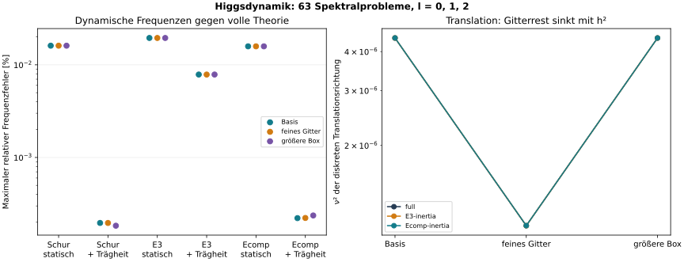

# HIGGS-DYNAMICS-1: reduzierte Higgsdynamik besteht den Frequenzvergleich

08.10.2026 · [E] neue CUDA-Spektralrechnung, [M] analytische Reduktion. Anschluss an den [Formelabgleich](../literatur-formeln-20261008/FORMEL-ABGLEICH.md) und die [statischen Winkeltests](../higgs-angular-modes-20261008/ERGEBNIS.md).

**Die neu hergeleitete Higgs-Trägheit verbessert die dynamischen Frequenzen deutlich.** Ecomp erreicht mit ihr einen maximalen relativen Frequenzfehler von **0,000237 %**, gegenüber **0,01583 %** mit unveränderter Materieträgheit. Das ist in diesem Vergleich ungefähr Faktor **67** weniger Fehler. Alle vorab definierten Vergleichskriterien sind erfüllt. In den untersuchten vollständigen endlichen Spektren wurde keine exponentiell wachsende Mode oberhalb der festgelegten Auflösung gefunden.



Das sind jetzt Frequenzen der **linearisierten gekoppelten Dynamik**, keine Quadratwurzeln der bisher publizierten statischen Fix-Q-Energiekrümmungen. Eine direkte nichtlineare Zeitintegration, Quantenrechnung oder experimentelle Teilchenmassenbestimmung ist damit nicht erfolgt.

## Umfang und Zahlen

Ein Parameterpunkt eta=0,05, g=0,005, c8=0, Q=600. Sieben Beschreibungen, drei Gitter-/Boxstufen und l=0,1,2: **63 Spektralprobleme**. Eingaben sind die vorhandenen seed=0-Profile von HIGGS-MINIMA-1; keine erneute Relaxation, kein Fit. Der Hintergrund ist radial in drei Raumdimensionen. Die Störungen enthalten auch die nicht-radialen Winkelordnungen 1 und 2.

| Beschreibung | Größter Frequenzfehler | Größter Fehlerdrift über Gitter/Box | Vorabkriterium |
|---|---:|---:|---|
| Exakte statische Schur-Energie, kanonische Trägheit | 0,016088 % | 0,004289 Prozentpunkte | bestanden |
| Gleiche Energie mit Higgs-Trägheit | 0,000197 % | 0,000197 Prozentpunkte | bestanden |
| E3, kanonische Trägheit | 0,019490 % | 0,002326 Prozentpunkte | bestanden |
| E3 mit Trägheit bis Portalordnung drei | 0,007857 % | 0,001990 Prozentpunkte | bestanden |
| Ecomp, kanonische Trägheit | 0,015833 % | 0,003995 Prozentpunkte | bestanden |
| Ecomp mit zusammengesetzter Higgs-Trägheit | **0,000237 %** | **0,000128 Prozentpunkte** | **bestanden** |

Verglichen wurden pro Winkelordnung die acht niedrigsten nichttrivialen positiven Frequenzen. Die diagnostisch bestätigte Translationsrichtung in l=1 wird gesondert behandelt. Die Grenzen waren maximal 5 % Frequenzfehler, maximal 0,5 Prozentpunkte Drift und keine Eigenwerte ν² < −1e−6. Die Grafik zeigt für jedes Modell die maximalen Fehler je Gitter-/Boxstufe; die Punkte sind keine statistischen Unsicherheiten.

Die Referenz-Schurmodelle verwenden denselben vollständigen Hintergrund. E3 und Ecomp verwenden jeweils ihre eigenen stationären Profile; ihre Fehler enthalten damit sowohl Näherungsfehler als auch die kleine Profilverschiebung. Die sehr kleinen Fehler sind **Abweichungen zwischen Modellen bei gleicher Diskretisierung**, kein Nachweis entsprechend genauer Kontinuumsfrequenzen. Höhere niedrige Boxmoden sind keine bereits identifizierten gebundenen Teilchenanregungen.

## Was tatsächlich diagonalisiert wurde

Für kanonische reelle Amplituden q, Phasen p und Higgsstörung h gilt im mitrotierenden Rahmen

```text
q̈ − 2ω ṗ + A q + B h = 0,
p̈ + 2ω q̇ + D p       = 0,
ḧ           + C h + Bᵀq = 0.
```

ω ist die Hintergrundfrequenz, ν die Störfrequenz. A ist der Operator bei festem ω. Bei radialen reduzierten Hessians wurde daher der Fix-Q-Rang-eins-Term ausdrücklich entfernt; er darf nicht zusätzlich zur vollständigen Ladungsdynamik eingesetzt werden.

Der Phasenblock D wurde zuerst geprüft. Die einzige entfernte Nullrichtung in l=0 stimmt mit der gemeinsamen Phase überein; Betrag des Eigenwerts, Überlapp und Ward-Residuum erfüllen die vorab definierten Kriterien. Alle übrigen Eigenwerte von D liegen über der vorgesehenen positiven Schwelle. Keine negative Richtung wurde durch Clipping beseitigt.

Mit P=ṗ+2ωq, festgehaltener linearer Gesamtladung und P=D^(1/2)w auf range(D) wird das vollständige Problem symmetrisch:

```text
H = [ A+4ω²I   −2ωD^(1/2)   B ]
    [−2ωD^(1/2)     D        0 ]
    [    Bᵀ         0        C ].
```

Seine Eigenwerte sind ν². Die gemeinsame reine Phasen-Nullrichtung ist separat dokumentiert, nicht als dynamische Instabilität gezählt. Für nichtverschwindende Wachstums-/Schwingungsexponenten erzwingt die lineare Ladungserhaltung den untersuchten δQ=0-Sektor. Die Aussage betrifft exponentielle Instabilitäten; allgemeine säkulare oder nichtlineare Effekte werden nicht ausgeschlossen.

Die exakte lineare Higgs-Elimination verwendet `C−ν²I`. Ihre niederfrequente Entwicklung liefert neben der statischen Energie `A−BC⁻¹Bᵀ` die zusätzliche Trägheit

```text
M_q = I + B C⁻² Bᵀ.
```

Für Ecomp folgt die Masse aus der eingesetzten Antwort z=z1+z2:

```text
Jk = (1/√2) dzk/du,
M_Ecomp = I + (J1+J2)ᵀ(J1+J2),
M_E3 = I + J1ᵀJ1 + J1ᵀJ2 + J2ᵀJ1.
```

E3 ist bis zur dritten Portalordnung gekürzt. Alle verwendeten Massmatrizen wurden positiv faktorisiert. Das verallgemeinerte Eigenproblem wird mit Cholesky-Massennormierung gelöst; die ursprüngliche Amplituden-/Phasenkopplung bleibt enthalten. Auf dem gemeinsamen Referenzhintergrund gilt die erwartete Ordnung `ν²_full ≤ ν²_inertia ≤ ν²_static` innerhalb der numerischen Genauigkeit. Das ist eine zusätzliche Kontrolle, keine von dieser Herleitung unabhängige neue Physikvorhersage.

## Kontrollen und Symmetrien

| Kontrolle | Größter Fehler beziehungsweise kleinster positiver Wert |
|---|---:|
| Eigenproblem-Residuum | 1,51e−11 |
| Orthonormalität nach Massennormierung | 7,90e−15 |
| Rückeinsetzen in ursprüngliche gekoppelte Gleichungen | 3,27e−8, Grenze 1e−7 |
| Exaktes frequenzabhängiges Schur-Residuum | 1,06e−11 |
| Lineare Ladungskontrolle | 2,68e−8, Grenze 1e−7 |
| Phasen-Ward-Residuum des Hintergrunds | 4,15e−8, Grenze 1e−6 |
| Tangentenmatrix gegen Autograd-JVP | 3,28e−16 |
| Radialer Energiehessian gegen unabhängige Energiedifferentiation | 1,89e−13 |
| Kleinster Higgsblock-Eigenwert | 4,714586 |
| Kleinster Trägheitseigenwert | 1 bis auf Rundung |

Die Originalgleichungs- und Eigenvektorprüfungen betreffen die gespeicherten niedrigen Moden. Für den Instabilitätsscan wurden dagegen alle Eigenwerte der jeweiligen endlichen Matrix ausgewertet. Die Winkelmultiplizität 2l+1 wird in den Zählwerten nicht zusätzlich ausmultipliziert. Ein Nullbefund bleibt eindeutig: In keiner der 63 untersuchten Matrizen liegt ein Eigenwert unter −1e−6.

Die exakte frequenzabhängige Schurkontrolle musste keine der geprüften Moden wegen Polnähe auslassen. Die Tangenten-JVP kontrolliert die assemblierte Summe J1+J2 gegen deren analytische Tangentenimplementierung; sie ist keine unabhängige Neubegründung der Antwortapproximation. Die Winkelenergie-Ableitung stützt sich zusätzlich auf die bereits separat geprüfte endliche Winkelintegration der Vorgängerstudie.

Die Translationsrichtung besteht für alle sieben Beschreibungen den vorab festgelegten Überlapp-, Kleinheits- und Verfeinerungstest. Ihre ν²-Werte sinken beim Halbieren von h ungefähr auf ein Viertel; die größere Box verändert sie nur wenig. Die drei Kurven rechts in der Grafik liegen praktisch übereinander. Diese Richtung ist ein diskreter Symmetrierest und wird nicht als neue sehr leichte Teilchenanregung ausgegeben.

## QA-Abbruch und unveränderte Fortsetzungskriterien

Der erste Lauf wurde nach 28 vollständig gespeicherten Spektren bei einer Genauigkeitsprüfung abgebrochen. Auf dem feinen Gitter in l=1 verstärkte die Formel `p/i=(P−2ωq)/ν` bei der nahezu nullfrequenten Translation die numerische Auslöschung. Das Originalgleichungsresiduum erreichte 5,8143e−7 und verfehlte die Grenze 1e−7.

Die [dokumentierte Korrektur](AMENDMENT.md) rekonstruiert denselben Phasenvektor besser konditioniert aus `D(p/i)=νP`, einschließlich des separat behandelten radialen Phasenkerns. Die Operatoren, Vergleichskriterien und Modeauswahl wurden nicht geändert. Die ersten 28 bestandenen Spektren wurden unverändert übernommen, die restlichen 35 mit korrigierter Rückrechnung erzeugt. Originalcode, Rohresultate und Journal des Abbruchs bleiben archiviert.

Eine zusätzliche Prüfung des rekonstruierten P wurde nur bei den 35 fortgesetzten Spektren ausgeführt: maximal 7,92e−13. Sie wird nicht rückwirkend für die ersten 28 behauptet. Die Abschlussprüfung bestätigt 63 eindeutige Spektral- und 54 Vergleichsdatensätze, unveränderte Eingabe-/Modell-/Planhashes und unverändert übernommene Ergebniszeilen.

## Einordnung und nächste Grenze

Die im Literaturreview vorgeschlagene dynamische Ergänzung **passt in diesem linearen Pilot**: Sie verbessert alle drei verglichenen reduzierten Beschreibungen und erhält die geprüften Symmetrien. Schon die Modelle ohne Zusatzträgheit liegen deutlich innerhalb der 5-%-Grenze; der neue Test misst eine weitere Genauigkeitsverbesserung, nicht die Rettung eines zuvor instabilen Modells.

Die Aussage bleibt auf einen Parameterpunkt, drei endliche Diskretisierungen und l=0,1,2 beschränkt. Offen bleiben endliche Störungen und direkte nichtlineare Zeitentwicklung, weitere Parameter, Resonanzbereiche, Quanteneffekte und die Übertragung auf V. Die dimensionenunabhängige Blockalgebra ersetzt nicht die notwendigen anderen Feldnormierungen, Maße und Winkeloperatoren in 1D/2D oder zusätzlichen räumlichen Dimensionen.

Keine elektroschwache Eichstruktur oder Hadronenquantenzahl wurde hinzugefügt. Entwicklungsschätzungen bleiben Higgs 2 %, schwache Kraft 2 %, Mesonen/Baryonen 10 %.

## Ausführung und Reproduzierbarkeit

CUDA float64, Quadro P5000, Torch 2.5.1+cu121 und cuSOLVER. Erster abgebrochener Dienst rund 32 s; Fortsetzung **82,61 s** Rechenzeit für die verbleibenden Aufgaben. Der Fortsetzungsprozess meldet knapp **0,97 GB** maximale Tensorbelegung, ohne CUDA-Kontext. CPU dient Ablauf, IO, skalaren Zusammenfassungen und Matplotlib. Kein CPU-Fallback für die Physikmatrizen; gemeinsame GPU-Pacht und Lock danach freigegeben. Andere Dienste blieben bestehen.

[Vorabplan](PLAN.md) · [analytisches Review](REVIEW.md) · [Code-Review](CODE-REVIEW.md) · [Rechencode](run.py) · [Modellableitungen](models.py) · [Auswertung/Grafik](analyse.py) · [Rohspektren](results/RESULT.json) · [Vergleiche](results/COMPARISONS.json) · [numerische QA](results/QA.json) · [Entscheidungskriterien](SUMMARY.json) · [Archivprüfung](ARCHIVE-QA.json) · [Provenienz](results/PROVENANCE.json) · [ursprünglicher Fehlversuch](initial-failure/JOURNAL.txt) · [Exportanpassung](EXPORT.json).

Eingabe: [HIGGS-MINIMA-1/RESULT.json](../higgs-minima-20261008/results/RESULT.json), SHA256 `a4a5fd942db57ab7a6b351840d0e64877eb29f7136450385d0c66cada4b601d9`. Zur vollständigen Wiederholung PLAN.md, AMENDMENT.md, REVIEW.md, run.py, models.py und analyse.py in einen frischen Nachbarordner der Eingabestudie kopieren, **ohne** vorhandene results/ oder initial-failure/. `python run.py` benötigt CUDA, anschließend `python analyse.py`. Der veröffentlichte Code passt nur den Eingabepfad an. Bestehende Ergebnisordner werden nicht überschrieben; Original- und Exporthash werden separat dokumentiert.
