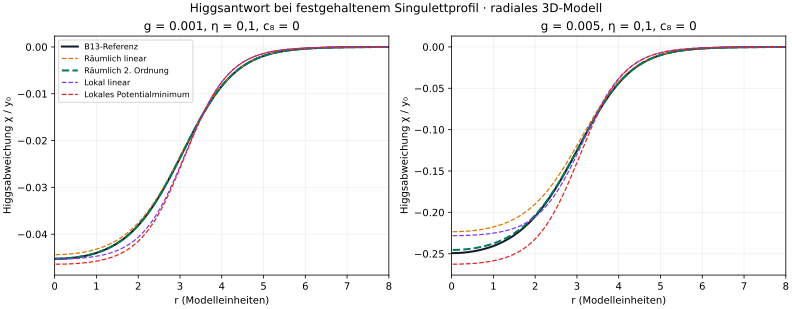

# HIGGS-RESPONSE-1: räumliche Antwort zweiter Ordnung besteht den Pilot

08.10.2026. **Neue numerische Auswertung vorhandener B13-Profile**, keine erneute Relaxation und kein neuer zeitabhängiger Lauf. Alle 24 Archivprofile wurden verwendet: zwei Mischparameter, zwei Portalstärken, zwei Oktikvarianten, jeweils Basisgitter, Feingitter und größere Box.

Die räumliche lineare Antwort reicht bei schwacher Portalkopplung. Bei stärkerer Kopplung verfehlt sie das vorab gesetzte Profilkriterium. Eine anschließend separat geplante Korrektur zweiter Ordnung besteht denselben Pilot für alle acht Parametergruppen. Das konkretisiert [Idee 01 aus den drei Entwicklungsrunden](../higgs-verbindungen-20261007/RUNDE-3.md).

## Was verglichen wurde

Die Singulettfelder bleiben identisch mit den archivierten Profilen. Nur die Higgsantwort wird angenähert. Referenz ist die in B13 gemeinsam relaxierte reale Higgsamplitude. Gemessen werden die volumenbezogene relative L2-Abweichung von chi=y−y0 und der Fehler des **Higgs-Energiebeitrags**, nicht der viel größeren Gesamtenergie.

- **N:** räumliche lineare Antwort über den diskreten massiven Green-Operator.
- **N2:** dieselbe Antwort einschließlich der analytisch abgeleiteten Korrektur zweiter Ordnung.
- **L:** lokale lineare Näherung ohne räumlichen Antwortoperator.
- **P:** punktweise exaktes Minimum des Higgs-Potentials, ohne Gradienten bei der Bestimmung des Profils.

Anschließend werden **alle** Profile im selben vollständigen diskreten Higgs-Energiefunktional einschließlich Gradienten bewertet. Somit wird P nicht durch Weglassen seiner tatsächlichen Gradientenenergie künstlich bevorzugt.

## Ergebnisse

Die Spannweiten betreffen die vier Kombinationen aus eta und c8 auf dem Feingitter. Die Einstufung verwendet zusätzlich sämtliche Basis-/Boxresultate und den vorab definierten Diskretisierungsindikator. Es sind keine statistischen Konfidenzintervalle.

| g | Näherung | Profilfehler, % | Fehler Higgsenergie, % | Parametergruppen |
|---|---|---:|---:|---|
| 0.001 | N | 1.25429–1.29146 | 0.01550–0.01640 | brauchbar (4/4) |
| 0.001 | N2 | 0.02628–0.02840 | 0.00001–0.00001 | brauchbar (4/4) |
| 0.001 | L | 7.39144–7.62087 | 0.65632–0.69448 | unzureichend (4/4) |
| 0.001 | P | 8.89896–9.15645 | 0.91182–0.96251 | unzureichend (4/4) |
| 0.005 | N | 6.51605–6.73531 | 0.35492–0.37671 | unzureichend (4/4) |
| 0.005 | N2 | 0.64403–0.70550 | 0.00344–0.00409 | brauchbar (4/4) |
| 0.005 | L | 5.32928–5.35002 | 0.38552–0.39285 | unzureichend (4/4) |
| 0.005 | P | 11.97063–12.38303 | 1.42341–1.51312 | unzureichend (4/4) |

Die winzigen schwachen N2-Energiefehler sind in der Tabelle gerundet; volle Werte stehen in den JSON-Dateien. Alle drei lokalen/linearen Alternativen haben in mindestens einem Regime einen unzureichenden Profilfehler, obwohl ihre Energiefehler unter 5 % liegen. **Eine gute Energie allein hätte die Profilfehler verdeckt.** In der Umgebung eines stationären Referenzprofils verschwindet die erste Energievariation; kleine Profilabweichungen können deshalb erst quadratisch in die Energie eingehen.




## Herleitung der neuen Korrektur

Bei festem S=|psi_1|²+|psi_2|² und chi=y−y0 gilt exakt:

```text
K chi + b*y0*S + b*S*chi + 3*a*y0*chi² + a*chi³ = 0,
K = −Delta + M_H², M_H²=6,25,
a=mh²/(2*v²*lambda), b=g/lambda.

chi1 = −K^(-1)(b*y0*S),
chi2 = −K^(-1)(b*S*chi1 + 3*a*y0*chi1²),
N2 = chi1 + chi2.
```

Dies ist die Entwicklung bis zur zweiten Ordnung in b **bei festgehaltenem S**. Keine Fitparameter, keine neue Singulettoptimierung, keine adaptiv gewählte höhere Ordnung. Für radiale 3D-Profile wird z=r*chi verwendet; der Operator ist −d²/dr²+6,25 mit z(0)=z(R)=0. Das ist kein eindimensionales physikalisches Modell.

## Vorabkriterien und Ablauf

Der [erste Plan](PLAN.md) wurde vor der Auswertung festgelegt. Er verlangt höchstens 5 % Profil- und Higgs-Energiefehler, ergänzt um einen beobachteten Gitter-/Boxindikator. Nach Abschluss des Erstvergleichs wurde der [Folgeplan für N2](FOLLOWUP-PLAN.md) festgehalten. Die ursprünglichen Kriterien und Ergebnisse bleiben bestehen.

„Brauchbar“ bedeutet hier: sämtliche Fehler plus Indikator höchstens 5 %, Indikator höchstens 0,5 Prozentpunkte. „Unzureichend“ verlangt eine entsprechende, gegen diesen Indikator abgegrenzte Überschreitung. Der Indikator ist keine rigorose Fehlerschranke. Kein Fall blieb im vorgesehenen Zwischenbereich unentschieden.

## Numerische Kontrollen und Rechenweg

- FFT-Inverse gegen unabhängigen dichten CUDA-Solve und bekannte Sinus-Eigenmode geprüft.
- Ableitung der Higgsenergie per Autograd gegen die explizite Feldgleichung geprüft.
- Verschwindende Portalkopplung liefert Nullantwort und verschwindenden Higgs-Energiebeitrag.
- Relative Operator-/Gradientenabweichungen kleiner als 8e−16; alle fünf Prüfungen bestanden.
- Die im Folgetest erneut ausgewerteten alten Methoden reproduzieren sämtliche vorherigen Vergleichswerte exakt in der gespeicherten Genauigkeit.
- Größtes relatives Gleichungsresiduum der archivierten Higgsreferenzen: 4,39e−8. Größter beobachteter Gitter-/Boxindikator der Fehlerraten: 8,56e−6, entsprechend 0,000856 Prozentpunkten.

Die numerischen Feldoperatoren, Normen, Energien und Autogradkontrollen liefen auf `.69`, Quadro P5000, CUDA float64. CPU für Ablaufsteuerung, JSON, skalare Zusammenfassung und Matplotlib-Grafiken. Gemessene Diagnosezeiten rund 1,85 s und 0,89 s, nicht isolierte Kernelzeiten; Service-Laufzeiten rund 5,0 s und 3,7 s. Der gemeldete zugewiesene GPU-Spitzenbedarf des Folgelaufs beträgt rund 0,20 MiB für Torch-Tensoren, **ohne** CUDA-Kontext und externe Prozesse. Vorhandener GPU-Lock, halbe Pacht und begrenzte kurzlebige Units; Pacht freigegeben, fremde Dienste unverändert.

## Einordnung: was wir damit weiterverwenden können

Die N2-Antwort ist ein geeigneter Kandidat für eine günstigere **statische** Beschreibung dieser geprüften Profilfamilie. Sie ersetzt noch keinen selbstkonsistenten Minimierer und keine Zeitentwicklung. Der nächste diskriminierende Schritt ist zu prüfen, ob eine daraus konsistent abgeleitete reduzierte Energie auch ihre Kräfte korrekt liefert und ob neu optimierte Profile im gültigen Bereich bleiben. Ein direktes Einsetzen einer statischen Antwort in dynamische Gleichungen würde Verzögerung und mögliche Strahlung ignorieren.

Lokale Potentialminimierung ist hier trotz ihres exakt gelösten lokalen Problems keine bessere räumliche Lösung. Mehr Nichtlinearität ohne räumliche Kopplung genügt also nicht. Die bessere N2-Antwort kombiniert beides bis zur geprüften Ordnung.

Dies ist Fortschritt bei einem Portalmodell mit gesetzten Higgsparametern, keine Herleitung von Higgsmasse, Baryonen oder schwacher Kraft. Die bisherigen groben README-Prozentwerte werden durch diesen engen Methodenbefund nicht neu skaliert.

## Daten und Reproduktion

- [Eingabeprofile](B13-PROFILES.json): unveränderte B13-Datei, SHA256 `1aa779f171b0ab3c3eb1b844d98934b18cb6dc129b398fff10ea7e33ce801a7d`.
- [Erstresultate](results/RESULT.json), [Erst-QA](results/QA.json).
- [Folgeresultate](results-second-order/RESULT.json), [Folge-QA](results-second-order/QA.json), [Reproduktionskontrolle](results-second-order/REPRODUCTION.json).
- [Provenienz](PROVENANCE.json), [kompakte Zusammenfassung](REPORT-SUMMARY.json).
- [Erstcode](run.py), [Folgecode](followup.py), [Grafik-/Tabellencode](report.py).

Die veröffentlichten Rechenskripte unterscheiden sich von den ausgeführten Dateien ausschließlich durch den auf die beigefügte Eingabedatei umgestellten Pfad. Original- und Exporthashes sind getrennt dokumentiert; der Export selbst wurde nicht als zusätzlicher Physiklauf ausgeführt. Die numerischen Formeln sind unverändert.

Für einen eigenen Wiederholungslauf eine **frische Kopie** des Ordners ohne die beiden Ergebnisordner verwenden; vorhandene Ergebnisse werden absichtlich nicht überschrieben. Mit einer geeigneten CUDA-PyTorch-Umgebung und ausgewählter freier GPU zuerst `python run.py`, dann `python followup.py`, optional `python report.py` ausführen. Im Projekt gelten dafür weiterhin Rechenbudgets und gemeinsame Locks; diese Befehle sind keine Umgehung der Ressourcenkoordination.
