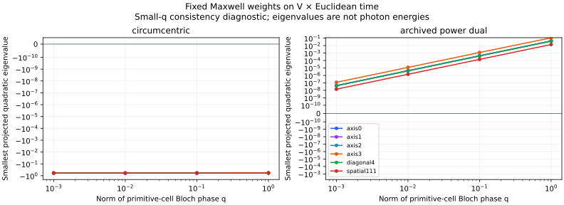

# Maxwell foundations: fixed-weight holdout and time-reflection obstruction

8 October 2026. Two narrowly defined follow-ups to the
[historical reproduction](../../reproducibility/maxwell-v/README.md), in three spatial dimensions plus Euclidean time.
Neither result validates V as fundamental spacetime or establishes a continuum limit.

## New momenta, unchanged weights

The [frozen holdout test](../../reproducibility/maxwell-holdout/README.md) uses 256 new uniform random points in the
four-dimensional Bloch zone (seed 20261008) and 48 ray evaluations: both signs of four axes and two diagonals,
at dimensionless phase-vector norms 1, 0.1, 0.01 and 0.001. No weight optimization was performed.
The sign pairs are useful numerical controls but are not independent physical directions.

| Fixed prescription | Resolved negative minima | Positive minima | Unresolved minima |
|---|---:|---:|---:|
| Circumcentric | 304 / 304 | 0 | 0 |
| Archived power-dual | 0 / 304 | 304 / 304 | 0 |

Signs use a frozen threshold of 1e-10 relative to the largest absolute eigenvalue of each gauge-projected matrix.
The smallest positive relative value is about 1.177e-9. It decreases towards the origin, as expected for soft modes;
this is not a uniform positive gap. The circumcentric minimum across the new sample is about -0.02652946.
Solver residual, Rayleigh-quotient, gauge-rank and incidence checks passed. Numerical kernels used CUDA
float64/complex128; integer geometry, input generation and orchestration used the CPU.

The result extends the old 96-point sample without tuning against the new points. It does not give a probability
that every momentum is stable: no measure of a possible unstable region is assumed, and finite samples cannot
exclude narrow or unsampled negative bands. No exact q=0 eigensystem was used; the gauge rank and harmonic modes
there require separate treatment.

These are eigenvalues of a Euclidean quadratic form against dimensionless primitive-cell Bloch phases, not
real-time photon energies or a calibrated physical dispersion relation. Shared source geometry and input weights
also mean this is not fully independent physical validation.

## Exact obstruction for a specified reflection

The [integer/rational certificate](../../reproducibility/maxwell-reflection/README.md) shows that the chosen staggered
embedding `t/tau = m + b/10` is not invariant under any pure time reflection `(x,t) -> (x,2*t0-t)` at fixed spatial
position, including equality modulo FCC Bravais translations.

The ten spatial sublattices are distinct modulo those translations. A fixed-space reflection must therefore retain
b. Writing `c=2*t0/tau`, it requires `c-b/5` to be an integer. Sublattice 0 requires `c=0 mod 1`, while sublattice 1
requires `c=1/5 mod 1`: contradiction. Eight exact checks, including synchronous and single-sublattice controls,
passed on the compute host. Simplex matching was unnecessary because vertex-set invariance already fails.

This is an obstruction of this embedding, not all realizations of spatial V. It does not prove nonunitarity,
violation of reflection-positivity inequalities, or failure of combined spatial/time symmetries, alternative time
slicings, transfer constructions or a continuum limit. Those are separate questions.

## What changes in the research assessment

The searched weights survive a useful new diagnostic. The plain circumcentric choice remains unstable, and the
simple time-reflection route now has an explicit missing assumption. Neither finding justifies increasing the
subjective maturity percentages. The next useful mathematical target is a positivity bound between sample points
and an explicit time-reconstruction construction; see [NEXT-TEST.md](NEXT-TEST.md).

[Separate AI code and mathematical review](REVIEW.md). No external human reproduction is claimed.
